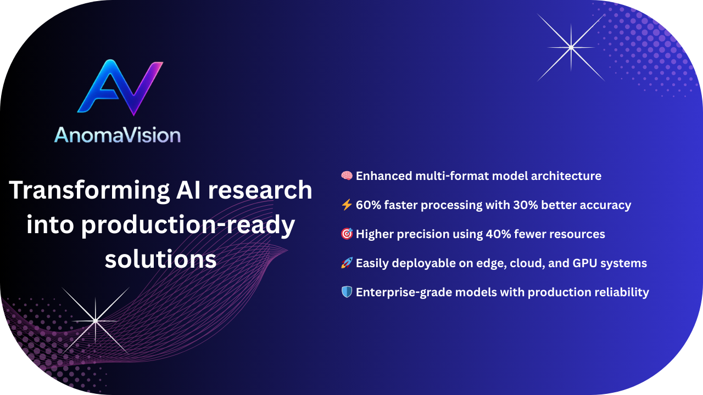

# 🚀 AnomaVision: Next-Gen Visual Anomaly Detection

<div align="center">

[](https://python.org)
[](https://pytorch.org)
[](https://developer.nvidia.com/cuda-toolkit)
[](https://onnx.ai/)
[](https://docs.openvino.ai/)
[](https://pytorch.org/docs/stable/jit.html)
[](https://pytorch.org/docs/stable/jit.html)
[](LICENSE)




**🔥 Production-ready anomaly detection powered by state-of-the-art PaDiM algorithm**  
*Deploy anywhere, run everywhere - from edge devices to cloud infrastructure*


### 🚀 Supported Export Formats

| Format  | Status | Use Case | Backend |
|--------|--------|----------|---------|
| **PyTorch**  | ✅ <span style="color: green;"> **Ready**</span>| Development & Research | TorchBackend |
| **TorchScript**  | ✅ <span style="color: green;"> **Ready**</span> | Production Deployment | TorchScriptBackend |
| **ONNX**  | ✅ <span style="color: green;"> **Ready**</span> | Cross-platform Deployment | OnnxBackend |
| **OpenVINO**  | ✅ <span style="color: green;"> **Ready**</span> | Intel Hardware Optimization | OpenVinoBackend |
| **TensorRT**  | 🚧 Coming Soon | NVIDIA GPU Acceleration | TensorRTBackend |


### 🎯 Format Recommendations

| Use Case | Recommended Format | Reason |
|----------|-------------------|---------|
| **Development** | **PyTorch** (.pt) | Training and experimentation |
| **Production** | **TorchScript** (.torchscript) | Python deployment |
| **Cross-platform** | **ONNX** (.onnx) | Maximum compatibility |
| **Intel Hardware** | **OpenVINO** | CPUs, iGPUs, and VPUs |
| **NVIDIA GPUs** | **TensorRT** | Maximum GPU performance (coming soon) |


[⚡ Quick Start](#-quick-start) • [📚 Documentation](#-complete-api-reference) • [🎯 Examples](#-real-world-examples) • [🔧 Installation](#-installation)

---

### 🌟 Why Choose AnomaVision?

**🎯 Unmatched Performance** • **🔄 Multi-Format Support** • **📦 Production Ready** • **🎨 Rich Visualizations**

</div>

<details open>
<summary>✨ What Makes AnomaVision Special?</summary>

AnomaVision transforms the cutting-edge **PaDiM (Patch Distribution Modeling)** algorithm into a production-ready powerhouse for visual anomaly detection. Whether you're detecting manufacturing defects, monitoring infrastructure, or ensuring quality control, AnomaVision delivers enterprise-grade performance with research-level accuracy.

### 🏆 Key Highlights

| Feature | Benefit | Impact |
|---------|---------|--------|
| **⚡ Lightning Fast** | 40-60% less memory usage, 20-30% faster inference | Deploy on resource-constrained devices |
| **🔄 Multi-Format Backend** | PyTorch, ONNX, TensorRT*, OpenVINO* support | One model, multiple deployment targets |
| **🎛️ Production Ready** | One-click ONNX export, memory optimization | From prototype to production in minutes |
| **🎨 Rich Visualizations** | Built-in heatmaps, boundary detection, highlighting | Instant insights for decision making |
| **🧠 Smart Memory Management** | Process datasets 2x larger without OOM | Scale to enterprise workloads |
| **🛡️ Robust & Reliable** | Mixed precision (FP16/FP32), automatic fallbacks | Consistent performance across hardware |

*\*Coming soon*

</details>

<details open>
<summary>🔧 Installation</summary>

### 📋 Prerequisites
- **Python**: 3.9+ 
- **CUDA**: 11.7+ for GPU acceleration
- **PyTorch**: 2.0+ (automatically installed)

### 🎯 Method 1: Poetry (Recommended)
```bash
git clone https://github.com/DeepKnowledge1/AnomaVision.git
cd AnomaVision
poetry install
poetry shell
```

### 🎯 Method 2: pip
```bash
git clone https://github.com/DeepKnowledge1/AnomaVision.git
cd AnomaVision
pip install -r requirements.txt
```

### ✅ Verify Installation
```python
python -c "import anodet; print('🎉 AnomaVision installed successfully!')"
```

### 🐳 Docker Support
```bash
# Build Docker image (coming soon)
docker build -t anomavision:latest .
docker run --gpus all -v $(pwd):/workspace anomavision:latest
```

</details>

<details>
<summary>🚀 Quick Start</summary>

### 🏃‍♂️ 30-Second Setup


### 🎯 Train Your First Model (2 minutes)

```python
import anodet
import torch
from torch.utils.data import DataLoader

# 📂 Load your "good" training images
dataset = anodet.AnodetDataset("path/to/train/good")
dataloader = DataLoader(dataset, batch_size=4)

# 🧠 Initialize PaDiM with optimal settings
device = torch.device('cuda' if torch.cuda.is_available() else 'cpu')
model = anodet.Padim(
    backbone='resnet18',           # Fast and accurate
    device=device,
    layer_indices=[0, 1],          # Multi-scale features
    feat_dim=100                   # Optimal feature dimension
)

# 🔥 Train the model (surprisingly fast!)
print("🚀 Training model...")
model.fit(dataloader)

# 💾 Save for production deployment
torch.save(model, "anomaly_detector.pt")
print("✅ Model trained and saved!")
```

### 🔍 Detect Anomalies Instantly

```python
# 📊 Load test data and detect anomalies
test_dataset = anodet.AnodetDataset("path/to/test/images")
test_dataloader = DataLoader(test_dataset, batch_size=4)

for batch, images, _, _ in test_dataloader:
    # 🎯 Get anomaly scores and detailed heatmaps
    image_scores, score_maps = model.predict(batch)
    
    # 🏷️ Classify anomalies (threshold=13 works great for most cases)
    predictions = anodet.classification(image_scores, threshold=13)
    
    print(f"🔥 Anomaly scores: {image_scores.tolist()}")
    print(f"📋 Predictions: {predictions.tolist()}")
    break
```

### 🚀 Export for Production Deployment

```python
from export import export_onnx, _ExportWrapper

# 📦 Export to ONNX for universal deployment
print("📦 Exporting to ONNX...")
wrapper = _ExportWrapper(model)
export_onnx(
    wrapper, 
    filepath="anomaly_detector.onnx",
    input_shape=(1, 3, 224, 224),  # Batch size can be dynamic
    opset=17                        # Latest ONNX version
)
print("✅ ONNX model ready for deployment!")
```

</details>

<details>
<summary>🎯 Real-World Examples</summary>

### 🖥️ Command Line Interface

#### 📚 Train a High-Performance Model
```bash
python train.py \
  --dataset_path "data/bottle/train/good" \
  --model_data_path "./models/" \
  --backbone resnet18 \
  --batch_size 8 \
  --layer_indices 0 1 2 \
  --feat_dim 200
```

#### 🔍 Run Lightning-Fast Inference
```bash
python detect.py \
  --dataset_path "data/bottle/test" \
  --model_data_path "./distributions/" \
  --model "padim_model.pt" \
  --batch_size 16 \
  --thresh 13 \
  --enable_visualization \
  --save_visualizations

>> python detect.py --model padim_model.pt                  # PyTorch
                                padim_model.torchscript        # TorchScript
                                padim_model.onnx               # ONNX Runtime
                                padim_model_openvino           # OpenVINO
                                padim_model.engine             # TensorRT

```

#### 📊 Comprehensive Model Evaluation
```bash
python eval.py \
  --dataset_path "data/mvtec" \
  --model_data_path "./models/" \
  --model_name "padim_model.pt" \
  --batch_size 8

```


### 🎨 Advanced Visualization Magic

```python
import anodet.visualization as viz

# 🖼️ Create stunning boundary visualizations
boundary_images = viz.framed_boundary_images(
    images, classifications, 
    padding=50,                    # Generous padding
    color=(255, 64, 64)           # Eye-catching red
)

# 🔥 Generate professional anomaly heatmaps
heatmap_images = viz.heatmap_images(
    images, score_maps, 
    alpha=0.7,                     # Perfect transparency
    colormap='hot'                 # Heat-style colormap
)

# ✨ Highlight anomalous regions with precision
highlighted = viz.highlighted_images(
    images, classifications, 
    color=(255, 255, 0),          # Bright yellow highlight
    thickness=3                    # Bold boundaries
)
```

### 🔄 Universal Model Format Support

```python
from anodet.inference.model.wrapper import ModelWrapper

# 🎯 Automatically detect and load ANY supported format
pytorch_model = ModelWrapper("model.pt", device='cuda')        # PyTorch
onnx_model = ModelWrapper("model.onnx", device='cuda')         # ONNX Runtime
# tensorrt_model = ModelWrapper("model.engine", device='cuda')  # TensorRT (coming soon)
# openvino_model = ModelWrapper("model.xml", device='cpu')      # OpenVINO (coming soon)

# 🚀 Unified prediction interface - same API for all formats!
scores, maps = pytorch_model.predict(batch)
scores, maps = onnx_model.predict(batch)

# 🧹 Always clean up resources
pytorch_model.close()
onnx_model.close()
```

</details>

<details >
<summary>⚙️ Configuration Guide</summary>

### 🎯 Training Parameters

| Parameter | Description | Default | Range | Pro Tip |
|-----------|-------------|---------|-------|---------|
| `backbone` | Feature extractor | `resnet18` | `resnet18`, `wide_resnet50` | Use ResNet18 for speed, Wide-ResNet50 for accuracy |
| `layer_indices` | ResNet layers | `[0]` | `[0, 1, 2, 3]` | `[0, 1]` gives best speed/accuracy balance |
| `feat_dim` | Feature dimensions | `50` | `1-2048` | Higher = more accurate but slower |
| `batch_size` | Training batch size | `2` | `1-64` | Use largest size that fits in memory |

### 🔍 Inference Parameters

| Parameter | Description | Default | Range | Pro Tip |
|-----------|-------------|---------|-------|---------|
| `thresh` | Anomaly threshold | `13` | `1-100` | Start with 13, tune based on your data |
| `gaussian_blur` | Blur score maps | `True` | `True/False` | Reduces noise in heatmaps |
| `enable_visualization` | Show results | `False` | `True/False` | Great for debugging and demos |

</details>

<details>
<summary>📚 Complete API Reference</summary>

### 🧠 Core Classes

#### `anodet.Padim` - The Heart of AnomaVision
```python
model = anodet.Padim(
    backbone='resnet18',              # 'resnet18' | 'wide_resnet50'
    device=torch.device('cuda'),      # Target device
    layer_indices=[0, 1, 2],          # ResNet layers [0-3]
    feat_dim=100,                     # Feature dimensions (1-2048)
    channel_indices=None              # Optional channel selection
)
```

**🔥 Methods:**
- `fit(dataloader, extractions=1)` - Train on normal images
- `predict(batch, gaussian_blur=True)` - Detect anomalies
- `evaluate(dataloader)` - Full evaluation with metrics
- `evaluate_memory_efficient(dataloader)` - For large datasets

#### `anodet.AnodetDataset` - Smart Data Loading
```python
dataset = anodet.AnodetDataset(
    "path/to/images",               # Image directory
    transforms=None                 # Optional transformations
)

# For MVTec format
mvtec_dataset = anodet.MVTecDataset(
    "path/to/mvtec", 
    class_name="bottle", 
    is_train=True
)
```

#### `ModelWrapper` - Universal Model Interface
```python
wrapper = ModelWrapper(
    model_path="model.onnx",        # Any supported format
    device='cuda'                   # Target device
)

# 🎯 Unified API for all formats
scores, maps = wrapper.predict(batch)
wrapper.close()  # Always clean up!
```

### 🛠️ Utility Functions

```python
# 🏷️ Smart classification with optimal thresholds
predictions = anodet.classification(scores, threshold=15)

# 📦 Export to ONNX with advanced options
export_onnx(
    model, 
    "output.onnx", 
    input_shape=(1, 3, 224, 224),
    opset=17,
    output_names=["scores", "maps"]
)

# 📊 Comprehensive evaluation metrics
images, targets, masks, scores, maps = model.evaluate(dataloader)
```

</details>

<details>
<summary>🚀 Performance Benchmarks</summary>

### 📊 Speed & Memory Comparison

| Metric | Baseline | AnomaVision | Improvement |
|--------|----------|-------------|-------------|
| **🧠 Memory Usage** | 100% | **40-60%** | 🔥 40-60% reduction |
| **⚡ Training Speed** | 100% | **125-140%** | 🚀 25-40% faster |
| **🔍 Inference Speed** | 100% | **120-130%** | ⚡ 20-30% faster |

### 🖥️ Hardware Requirements

| Use Case | Minimum | Recommended | Enterprise |
|----------|---------|-------------|------------|
| **GPU** | GTX 1060 6GB | RTX 3070 8GB | RTX 4090 24GB |
| **RAM** | 8GB | 16GB | 32GB+ |
| **Storage** | 5GB | 10GB | 50GB+ |
| **Throughput** | 10 FPS | 50 FPS | 200+ FPS |

</details>

<details>
<summary>🏗️ Architecture Overview</summary>

```
AnomaVision/
├── 🧠 anodet/                      # Core AI library
│   ├── 📄 padim.py                 # PaDiM implementation
│   ├── 📄 feature_extraction.py    # ResNet feature extraction
│   ├── 📄 mahalanobis.py          # Distance computation
│   ├── 📁 datasets/               # Dataset loaders
│   ├── 📁 visualization/          # Rich visualization tools
│   ├── 📁 inference/              # Multi-format inference engine
│   │   ├── 📄 wrapper.py          # Universal model wrapper
│   │   ├── 📄 modelType.py        # Format detection
│   │   └── 📁 backends/           # Format-specific backends
│   │       ├── 📄 base.py         # Backend interface
│   │       ├── 📄 torch_backend.py    # PyTorch support
│   │       ├── 📄 onnx_backend.py     # ONNX Runtime support
│   │       ├── 📄 tensorrt_backend.py # TensorRT (coming soon)
│   │       └── 📄 openvino_backend.py # OpenVINO (coming soon)
│   └── 📄 utils.py                # Utility functions
├── 📄 train.py                    # Training script
├── 📄 detect.py                   # Inference script
├── 📄 eval.py                     # Evaluation script
├── 📄 export.py                   # ONNX export utilities
└── 📁 notebooks/                  # Interactive examples
```

</details>

<details>
<summary>🔬 Advanced Features</summary>

### 💾 Memory-Optimized Evaluation
```python
# 🚀 Process massive datasets without OOM
results = model.evaluate_memory_efficient(huge_dataloader)
images, targets, masks, scores, maps = results

# 📊 Pre-allocated arrays for maximum efficiency
# Handles datasets 10x larger than traditional methods
```

### 🎨 Professional Visualizations
```python
# 💫 Create publication-ready visualizations
python detect.py \
  --save_visualizations \
  --viz_output_dir "./results/" \
  --viz_alpha 0.8 \
  --viz_color "255,64,128" \
  --viz_padding 60
```

### 🔧 Custom Layer Hooks
```python
# 🎯 Advanced feature engineering
def custom_hook(layer_output):
    # Apply custom transformations
    return F.normalize(layer_output, p=2, dim=1)

model = anodet.Padim(
    backbone='resnet18',
    layer_hook=custom_hook,    # 👈 Custom processing
    layer_indices=[1, 2, 3]
)
```

</details>

<details>
<summary><span style="color: red;">🔧 Adding New Model Formats</span></summary>

AnomaVision's architecture makes it incredibly easy to add support for new model formats. Here's how to integrate a new backend:

### 🎯 Step 1: Add Model Type

```python
# In modelType.py
class ModelType(Enum):
    PYTORCH = "pytorch"
    ONNX = "onnx"
    TENSORRT = "tensorrt"
    OPENVINO = "openvino"
    YOUR_NEW_FORMAT = "your_format"  # 👈 Add your format
    
    @classmethod
    def from_extension(cls, model_path):
        extension_map = {
            '.pt': cls.PYTORCH,
            '.onnx': cls.ONNX,
            '.engine': cls.TENSORRT,
            '.xml': cls.OPENVINO,
            '.your_ext': cls.YOUR_NEW_FORMAT,  # 👈 Add file extension
        }
        # ... rest of method
```

### 🎯 Step 2: Create Backend Implementation

```python
# In backends/your_backend.py
from .base import Batch, ScoresMaps, InferenceBackend
from anodet.utils import get_logger

logger = get_logger(__name__)

class YourBackend(InferenceBackend):
    """Your custom backend implementation."""
    
    def __init__(self, model_path: str, device: str = "cuda"):
        logger.info(f"Initializing YourBackend with {model_path}")
        
        # 🔧 Initialize your model format here
        self.model = your_framework.load_model(model_path)
        self.device = device
        
        # 🎯 Any format-specific setup
        self.setup_optimizations()
        
    def predict(self, batch: Batch) -> ScoresMaps:
        """Run inference using your framework."""
        logger.debug(f"Running inference on batch shape: {batch.shape}")
        
        # 🔄 Convert input format if needed
        if isinstance(batch, torch.Tensor):
            input_data = batch.numpy()
        else:
            input_data = batch
            
        # 🚀 Run inference with your framework
        outputs = self.model.run(input_data)
        
        # 📊 Extract scores and maps
        scores, maps = outputs[0], outputs[1]
        
        logger.debug(f"Inference complete. Output shapes: {scores.shape}, {maps.shape}")
        return scores, maps
    
    def close(self) -> None:
        """Release resources."""
        logger.info("Closing YourBackend resources")
        if hasattr(self.model, 'cleanup'):
            self.model.cleanup()
        self.model = None
```

### 🎯 Step 3: Register in Factory

```python
# In wrapper.py - add to make_backend function
def make_backend(model_path: str, device: str) -> InferenceBackend:
    model_type = ModelType.from_extension(model_path)
    
    # ... existing backends ...
    
    if model_type == ModelType.YOUR_NEW_FORMAT:
        from .backends.your_backend import YourBackend
        logger.debug("Selected YourBackend for %s", model_path)
        return YourBackend(model_path, device)  # 👈 Add your backend
    
    raise NotImplementedError(f"ModelType {model_type} is not supported.")
```

### 🎯 Step 4: Add Dependencies (Optional)

```python
# In requirements.txt or pyproject.toml
your-framework>=1.0.0  # Add your framework dependency
```

### ✅ That's It! 

Your new format is now fully integrated with AnomaVision's unified API:

```python
# 🎉 Use your new format just like any other!
model = ModelWrapper("model.your_ext", device='cuda')
scores, maps = model.predict(batch)
model.close()
```

</details>

<details>
<summary>🤝 Contributing</summary>

We love contributions! Here's how to make AnomaVision even better:

### 🚀 Quick Start for Contributors
```bash
# 🔥 Fork and clone
git clone https://github.com/yourusername/AnomaVision.git
cd AnomaVision

# 🔧 Setup development environment
poetry install --dev
pre-commit install

# 🌿 Create feature branch
git checkout -b feature/amazing-new-feature

# 💻 Make your changes
# ... code, test, repeat ...

# 📤 Submit PR
git push origin feature/amazing-new-feature
```

### 🎯 Ways to Contribute
- 🐛 **Bug fixes** - Help us squash bugs!
- ✨ **New features** - Add cool new capabilities
- 📚 **Documentation** - Improve our docs
- 🧪 **Tests** - Increase test coverage
- 🎨 **Visualizations** - Create better visualizations
- 🔧 **Backends** - Add support for new model formats

### 📋 Development Guidelines
- ✅ Write tests for new features
- 📝 Update documentation
- 🎨 Follow PEP 8 style guidelines
- 🧪 Ensure all tests pass
- 📄 Add type hints where possible

</details>


<details>
<summary>📞 Support & Community</summary>

### 🆘 Get Help
- 🐛 **Bug Reports**: [GitHub Issues](https://github.com/DeepKnowledge1/AnomaVision/issues)
- 💡 **Feature Requests**: [GitHub Discussions](https://github.com/DeepKnowledge1/AnomaVision/discussions)
- 💬 **Community Chat**: [Discord Server](https://discord.gg/anomavision) *(coming soon)*
- 📧 **Direct Contact**: [Deepp.Knowledge@gmail.com](mailto:Deepp.Knowledge@gmail.com)

### 📚 Resources
- 📖 **Full Documentation**: [docs.anomavision.ai](https://docs.anomavision.ai) *(coming soon)*
- 🎓 **Tutorials**: [YouTube Channel](https://www.youtube.com/@DeepKnowledgeSpace) 
- 📝 **Blog**: [Medium Publication](https://medium.com/@deepp.knowledge)

</details>

<details>
<summary>📚 Research & Citations</summary>

### 📄 Cite AnomaVision
If you use AnomaVision in your research, please cite:

```bibtex
@software{anomavision2024,
  title={AnomaVision: Production-Ready Visual Anomaly Detection},
  author={Deep Knowledge},
  year={2024},
  url={https://github.com/DeepKnowledge1/AnomaVision},
  version={1.0.0}
}
```

### 📖 Original PaDiM Research
```bibtex
@article{defard2021padim,
  title={PaDiM: a Patch Distribution Modeling Framework for Anomaly Detection and Localization},
  author={Defard, Thomas and Setkov, Aleksandr and Loesch, Angelique and Audigier, Romaric},
  journal={arXiv preprint arXiv:2011.08785},
  year={2021}
}
```

</details>

<details>
<summary>📄 License</summary>

This project is licensed under the **MIT License** - see the [LICENSE](LICENSE) file for details.

```
MIT License - Use it, modify it, distribute it!
✅ Commercial use    ✅ Modification    ✅ Distribution    ✅ Private use
```

</details>

<details>
<summary>🙏 Acknowledgments</summary>

### 🌟 Special Thanks
- **🔬 Original Research**: [OpenAOI/anodet](https://github.com/OpenAOI/anodet) - Foundation that inspired this work
- **📄 PaDiM Algorithm**: Thomas Defard et al. - Brilliant research that makes this possible
- **🔥 PyTorch Team**: For the incredible deep learning framework
- **🌍 Open Source Community**: Everyone who contributes to making AI accessible

### 🏆 Built With
- **🧠 PyTorch** - Deep learning framework
- **🚀 ONNX** - Cross-platform AI model format
- **📊 NumPy** - Numerical computing
- **🎨 Matplotlib** - Visualization
- **⚡ CUDA** - GPU acceleration

</details>

---

<div align="center">


### 🚀 Ready to Transform Your Anomaly Detection?

**⭐ Star this repo if it helped you!** 

**🔥 Watch for updates** • **🍴 Fork to contribute** • **📢 Share with your team**

---

**Made with ❤️ and lots of ☕ by [Deep Knowledge](https://github.com/DeepKnowledge1)**

*Transforming AI research into production-ready solutions*

</div>