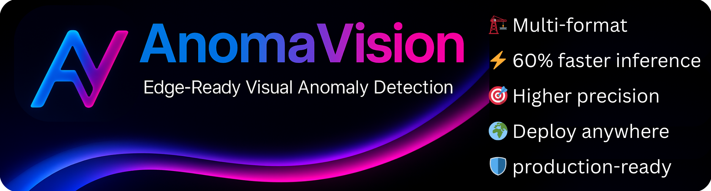
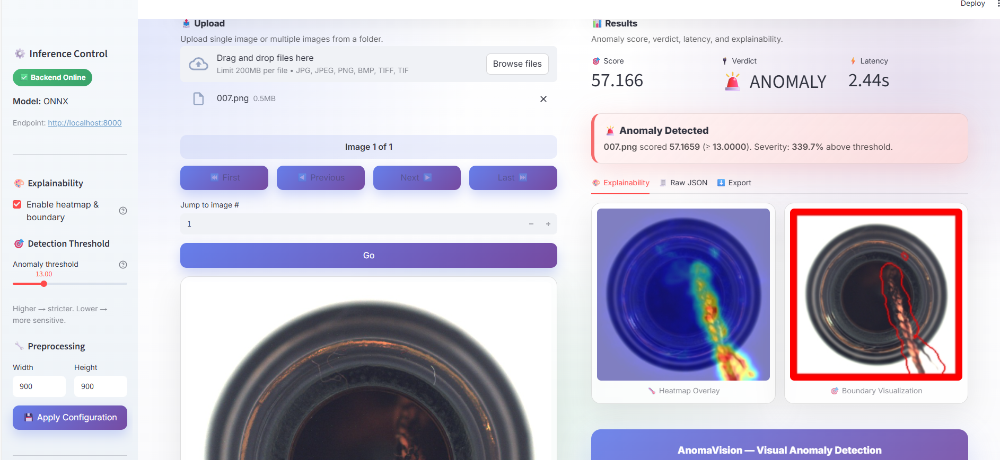

# 🚀 AnomaVision: Edge-Ready Visual Anomaly Detection


<!-- Row 1: Language + Frameworks -->
[](https://www.python.org/)
[](https://pytorch.org)
[](https://onnx.ai/)
[](https://docs.openvino.ai/)
[](https://pytorch.org/docs/stable/jit.html)
[](https://developer.nvidia.com/tensorrt)
[](https://onnxruntime.ai/docs/performance/quantization.html)

<!-- Row 2: Distribution + License -->
[](https://pypi.org/project/anomavision/)
[](https://pypi.org/project/anomavision/)
[](LICENSE)


**🔥 Lightweight, fast, and production-ready anomaly detection — powered by PaDiM.**
*Deploy anywhere: edge devices, servers, or the cloud.*


---

## ✨ Features

* 📦 **Multi-backend exports**: PyTorch, ONNX, TorchScript, OpenVINO, TorchRT,INT8 Quantization
* 🎨 **Visualizations**: anomaly heatmaps, bounding boxes, ROC curves
* 🖥️ **Unified Python + CLI workflows**
* 🌐 **Edge-first design** with compact `.pth` models
* ⚡ **C++ inference** runtime for edge deployment
* 🎯 **Interactive Streamlit Demo** — Upload images and see real-time anomaly detection instantly!**New!**
* 🚀 **FastAPI Backend** — Production-ready REST API for seamless integration **New!**

---

# 🎨 AnomaVision — Real-Time, Explainable Visual Anomaly Detection!

**Experience AnomaVision in action with our Streamlit web interface!**

### 🌟 Demo Highlights

<div align="left">
  
  <p><em>Real-time anomaly detection with explainable heatmaps and interactive controls</em></p>
</div>

* ⚡ **Real-time anomaly detection** — Upload images and get instant results
* 🎯 **Explainable AI** — Visual heatmaps show exactly where anomalies occur
* 📊 **Interactive threshold control** — Adjust sensitivity on the fly
* 📁 **Batch processing** — Upload multiple images from folders
* 🖼️ **Side-by-side visualization** — Compare original, heatmap, and boundary images
* 💾 **Export results** — Download JSON reports for further analysis
* 🎮 **No coding required** — Intuitive interface for instant testing

### 🚀 Quick Start Demo

```bash
# 1. Start the FastAPI backend
uvicorn apps.api.fastapi_app:app --host 0.0.0.0 --port 8000

# 2. Launch the Streamlit demo (in a new terminal)
streamlit run apps/ui/streamlit_app.py -- --port 8000
```

Then open your browser to `http://localhost:8501` and start detecting anomalies!


> 💡 **Perfect for**: Quick testing, demonstrations, onboarding new users, and showcasing your anomaly detection models!

---

<h2 align="left" style="color:red;">🆚 Why AnomaVision over Anomalib?</h2>

* ⚡ **3× faster inference** on CPU (MVTec & Visa benchmarks)
* 📦 **Smaller models** (30 MB vs 40 MB) with **lower memory usage**
* 🎯 **Higher AUROC** across most classes on **both MVTec AD and Visa datasets**
* 🌍 **Edge-first design** → optimized for ONNX, TorchScript, and OpenVINO
* 🛡️ **Production-ready** with clean API, CLI, and deployment options
* 🎨 **Interactive demo** — Instant visual feedback without writing code

### ⚡ **Speed Comparison (CPU Mode)**

| Metric | 🟢 **AnomaVision** | 🔵 **Anomalib** | 📊 **Difference** | 🏆 **Winner** |
|:--|:--:|:--:|:--:|:--:|
| 🧮 **Training Time (s)** | **8.38** | 13.07 | **-35.9%** | 🟢 AV |
| 🚀 **Inference FPS** | **43.41** | 13.03 | **+233%** | 🟢 AV |
| ⏱️ **ms / image** | **23.0** | 76.7 | **-70%** | 🟢 AV |

> ⚡ **AnomaVision** trains faster, infers over **3× quicker**,
> and processes each image in **70% less time** —
> making it **ideal for real-time CPU deployment**.


### ⚡ **Speed Comparison (CUDA Mode)**

| Metric | 🟢 **AnomaVision** | 🔵 **Anomalib** | 📊 **Difference** | 🏆 **Winner** |
|:--|:--:|:--:|:--:|:--:|
| 🧮 **Training Time (s)** | **8.38** | 13.07 | **-35.9%** | 🟢 AV |
| 🚀 **Inference FPS** | **547.46** | 355.72 | **+53.9%** | 🟢 AV |
| ⏱️ **ms / image** | **1.83** | 2.81 | **-35.0%** | 🟢 AV |

> ⚡ *AnomaVision runs over **1.5× faster** — ideal for real-time edge inspection.*

👉 See detailed results in [Benchmarks](docs/benchmark.md).

👉 [Download: AnomaVision vs Anomalib — A Comprehensive Performance Analysis (PDF)](docs/AnomaVision_vs_Anomalib.pdf)

---


## 🖥️ C++ Inference with ONNX

AnomaVision isn't just Python 🚀 — it also provides a **C++ implementation** for **ONNX Runtime + OpenCV**.

* 🖼️ **Full pipeline**: preprocessing → inference → postprocessing → visualization
* 📦 **Modular design** (Config, Preprocessor, ONNXModel, Postprocessor, Visualizer, App)
* 🌐 Perfect for **edge devices** and **production environments** without Python

👉 See full guide: [Quickstart — C++ Inference](docs/cpp/README.md)

---

## 🚀 Complete Deployment Options

AnomaVision provides multiple deployment paths to fit your needs:

| Deployment Method | Best For | Key Benefits |
|:------------------|:---------|:-------------|
| 🎨 **Streamlit Demo** | Demos, testing, onboarding | Zero-code UI, instant feedback |
| 🔌 **FastAPI Backend** | Production APIs, microservices | REST endpoints, scalable |
| 🖥️ **C++ Runtime** | Edge devices, embedded systems | No Python dependency, ultra-fast |
| 💻 **Python CLI** | Batch processing, automation | Scriptable, configurable |
| 📦 **PyPI Package** | Custom integration | Import as library |

---

## 📚 Documentation

📖 Full docs are available in the [`/docs`](docs/index.md) folder.

* [Installation](docs/installation.md)
* [Quick Start](docs/quickstart.md)
* [Streamlit Demo Guide](docs/streamlit_demo.md) ⭐ **New!**
* [FastAPI Backend Setup](docs/fastapi_backend.md) ⭐ **New!**
* [CLI Reference](docs/cli.md)
* [API Reference](docs/api.md)
* [Configuration Guide](docs/config.md)
* [Benchmarks](docs/benchmark.md)
* [Troubleshooting & FAQ](docs/troubleshooting.md) → Common issues and fixes
* [Contributing](docs/contributing.md)

---

## Installation

Quick Install using [Pyenv and Poetry](https://youtu.be/ocVk_B-ivHQ):
```bash
git clone https://github.com/DeepKnowledge1/AnomaVision.git
cd AnomaVision
poetry install
poetry shell
```

From PYPI: [PYPI Video](https://youtu.be/SDM22RI3O7g)
```bash
pip install AnomaVision
```

➡ For detailed installation options, see [Installation Guide](docs/installation.md).
---

## ⚡ Quick Example

Train with a config file:

```bash
python train.py --config config.yml

## Save:
# Full model → padim_model.pt
# Compact stats-only model → padim_model.pth
# Config snapshot → config.yml

```

Run detection:

```bash
python detect.py --config config.yml
```

Evaluate performance:

```bash
python eval.py --config config.yml
```

Export to ONNX:

```bash
python export.py --config export_config.yml
```

### 🔌 API Usage

```python
import requests

# Predict anomaly
with open("test_image.jpg", "rb") as f:
    response = requests.post(
        "http://localhost:8000/predict",
        files={"file": f},
        params={"include_visualizations": True}
    )
    result = response.json()
    print(f"Anomaly Score: {result['anomaly_score']}")
    print(f"Is Anomaly: {result['is_anomaly']}")
```

➡ For more examples, see [Quick Start](docs/quickstart.md).

---

## 📊 Benchmarks (Summary)

### MVTec AD (15 classes)

* **Image AUROC**: AV 0.85 ↑ vs AL 0.81
* **Pixel AUROC**: AV 0.96 ↑ vs AL 0.94
* **FPS**: AV 43 ↑ vs AL 13

### Visa (12 classes)

* **Image AUROC**: AV 0.81 ↑ vs AL 0.78
* **Pixel AUROC**: AV 0.96 ↑ vs AL 0.95
* **FPS**: AV 45 ↑ vs AL 13

📊 Full tables & plots → [Benchmarks](docs/benchmark.md)

---

## 🎯 Use Cases

AnomaVision is perfect for:

* 🏭 **Manufacturing Quality Control** — Detect defects in real-time on production lines
* 🔬 **Medical Imaging** — Identify anomalies in X-rays, MRIs, and microscopy
* 🏗️ **Infrastructure Inspection** — Spot cracks, corrosion, and damage in structures
* 📱 **PCB Inspection** — Find soldering defects and component issues
* 🌾 **Agricultural Monitoring** — Detect plant diseases and crop anomalies
* 🚗 **Automotive QA** — Identify paint defects and assembly issues

---

## 🤝 Contributing

We welcome contributions!

* See [Contributing Guide](docs/contributing.md) for high-level steps

---

## 🙏 Acknowledgments

AnomaVision is built on top of the excellent [**Anodet**](https://github.com/OpenAOI/anodet) repository.
We thank the original authors for their contributions to open-source anomaly detection research, which laid the foundation for this work.

---


## 📜 Citation

If you use AnomaVision in your research, please cite:

```bibtex
@software{anomavision2025,
  title={AnomaVision: Edge-Ready Visual Anomaly Detection},
  author={DeepKnowledge Contributors},
  year={2025},
  url={https://github.com/DeepKnowledge1/AnomaVision},
}
```

---

## 💬 Community & Support

* 📢 [Discussions](https://github.com/DeepKnowledge1/AnomaVision/discussions)
* 🐛 [Issues](https://github.com/DeepKnowledge1/AnomaVision/issues)
* 📧 [deepp.knowledge@gmail.com](mailto:deepp.knowledge@gmail.com)

---

👉 Start with [Quick Start](docs/quickstart.md) and build your first anomaly detection pipeline in **5 minutes**!

