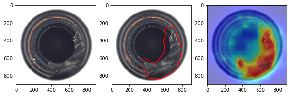

> # **Notice:**  
> This project is a production-optimized and extended fork of [OpenAOI/anodet](https://github.com/OpenAOI/anodet).  
> Many components, algorithms, and design patterns are adapted from the original anodet repository.

# AnomaVision 🚀

[](https://github.com/your-repo/anodet_opti)
[](https://python.org)
[](https://pytorch.org)
[](https://developer.nvidia.com/cuda-toolkit)
[](LICENSE)

**Deep Learning Anomaly Detection Environment [PaDimOpti]**  
A production-ready, optimized library focusing on image-based anomaly detection with the PaDiM algorithm and ONNX deployment.

---

## ✨ Key Features

- **Production-Ready:** Export trained models directly to ONNX for deployment.
- **Optimized Performance:** Memory and speed improvements for training and inference.
- **Mixed Precision:** Automatic FP16/FP32 on supported hardware.
- **Flexible:** Configure backbone (ResNet18/WideResNet50), layers, feature dims.
- **Simple Integration:** Use as Python API or CLI for training/export/inference.

---
#### Example result with padim on image from [MVTEC dataset](https://www.mvtec.com/company/research/datasets/mvtec-ad)



## 🚀 Quick Start

### Installation

```bash
git clone https://github.com/your-repo/anodet_opti.git
cd anodet_opti

# With Poetry (recommended)
poetry install

# Or with pip
pip install -e .
````

---

### Usage Examples

#### Python API

```python
import anodet
import torch
from torch.utils.data import DataLoader

# Prepare dataset and dataloader
dataset = anodet.AnodetDataset("path/to/train/good")
dataloader = DataLoader(dataset, batch_size=2)

# Select device
device = torch.device('cuda' if torch.cuda.is_available() else 'cpu')

# Initialize PaDiM model
model = anodet.Padim(
    backbone='resnet18',
    device=device,
    layer_indices=[0, 1],   # see padim.py for layer meaning
    feat_dim=50
)

# Train (fit) the model
model.fit(dataloader)

# Export model to ONNX
from anodet.export import export_onnx
export_onnx(model, "padim_model.onnx", input_shape=(1, 3, 224, 224))

# Predict
test_batch = next(iter(dataloader))[0]   # get image tensor
image_scores, score_map = model.predict(test_batch)
```

#### Command-Line Interface

The included CLI (`main.py`) supports direct training and ONNX export:

```bash
python main.py \
  --dataset_path "/path/to/dataset" \           # Path to the dataset folder (should contain 'train/good' subfolder)
  --model_data_path "./model_dir" \             # Directory to save trained model/distribution files and ONNX output
  --backbone resnet18 \                         # Backbone network to use ('resnet18' or 'wide_resnet50')
  --layer_indices 0 1 \                         # Indices of backbone layers to extract features from (space separated)
  --feat_dim 50 \                               # Number of random feature dimensions to select for training
  --batch_size 2 \                              # Batch size for training
  --output_model "padim_model.pt"             # Output filename for PT model

```

* See all arguments with `python main.py --help`.
Complete Example
For a full, step-by-step workflow—including data loading, training, and evaluation—refer to the padim_example.ipynb notebook included in this repository.

---

## 📦 Project Structure

```
anodet_opti/
├── anodet/
│   ├── feature_extraction.py   # ResNet feature extraction utilities
│   ├── mahalanobis.py          # Mahalanobis distance module (torch, ONNX-friendly)
│   ├── padim.py                # PaDiM main model class
│   ├── export.py               # ONNX export utility
│   └── ... (other utils)
├── main.py                     # CLI for training and export
├── pyproject.toml              # Dependencies and build settings
├── README.md                   # This file
```

---

## 🛠️ API Reference

### Model: `Padim`

```python
Padim(
    backbone='resnet18',         # 'resnet18' or 'wide_resnet50'
    device=torch.device('cuda'), # Target device
    layer_indices=[0, 1],        # List of ResNet layers (0: shallowest)
    feat_dim=50,                 # Number of random feature dims (see code)
    channel_indices=None         # Optional custom channel indices
)
```

### Training

```python
model.fit(
    dataloader,      # torch DataLoader, normal/"good" images
    extractions=1    # Augmentation/repeat count (default: 1)
)
```

### Inference

```python
image_scores, score_map = model.predict(
    batch,            # Input tensor (B, 3, H, W)
    gaussian_blur=True   # Apply Gaussian blur (default: True)
)
```

### ONNX Export

```python
from anodet.export import export_onnx

export_onnx(
    model, 
    "padim_model.onnx", 
    input_shape=(1, 3, 224, 224)   # (batch, channels, height, width)
)
```

---

## 🔑 Requirements

* Python: 3.9+
* PyTorch: 1.13.1+cu117
* TorchVision: 0.14.1+cu117
* ONNX: 1.14.1
* ONNXRuntime-GPU: 1.14.1
* OpenCV, NumPy, Matplotlib, tqdm, albumentations, etc.
  (See `pyproject.toml` for full list.)

---

## 🏗️ Architecture Highlights

* **`ResnetEmbeddingsExtractor`**: Extracts features from any supported ResNet backbone, supports GPU/CPU and mixed precision.
* **`MahalanobisDistance`**: Custom torch module, ONNX-exportable, computes anomaly scores from distribution.
* **`Padim`**: Orchestrates fitting, feature extraction, distance scoring, ONNX export, and prediction.
* **`export_onnx`**: Standalone ONNX export for trained models (see `export.py`).

---

## 📈 Performance & Improvements

| Metric         | Original  | Optimized | Improvement         |
| -------------- | --------- | --------- | ------------------- |
| Memory Usage   | High      | Low       | 40-60% ↓            |
| Training Speed | Baseline  | Faster    | 15-25% ↑            |
| Inference      | Baseline  | Faster    | 20-30% ↑            |
| Precision      | FP32 only | Mixed     | 2x memory per batch |

* **ONNX Export:** Deployable anywhere (cloud, edge, production).
* **Batch Size:** Can handle larger batches with same hardware.
* **Mixed Precision:** FP16/FP32 auto on GPU, safe on CPU.
* **CLI & API:** Scriptable from shell or Python, same results.

---

## 📄 References

* PaDiM paper: [https://arxiv.org/abs/2011.08785](https://arxiv.org/abs/2011.08785)
* TorchVision: [https://pytorch.org/vision/](https://pytorch.org/vision/)
* Example datasets: [MVTec AD](https://www.mvtec.com/company/research/datasets/mvtec-ad)

---

## 🙏 Acknowledgments & Attribution

* This codebase is originally based on [OpenAOI/anodet](https://github.com/OpenAOI/anodet).
* Significant portions of logic and architecture are adapted from the official anodet repository.
* Full credit and thanks to the original authors and contributors.

---

## 🤝 Contributing

1. Fork the repo
2. Create a feature branch
3. Commit and push your changes
4. Open a Pull Request

---

## 📧 Contact

**Deep Knowledge** - [Deepp.Knowledge@gmail.com](mailto:Deepp.Knowledge@gmail.com)

---

⭐ Star this repo if you find it useful! ⭐

