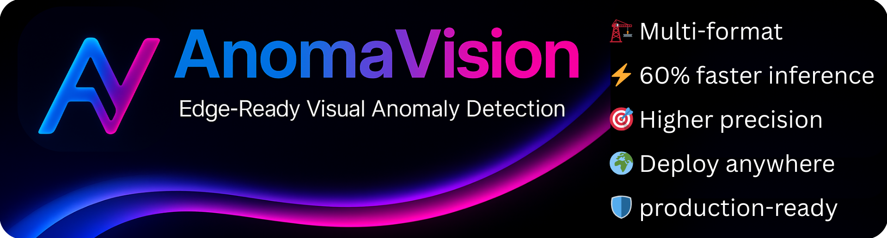
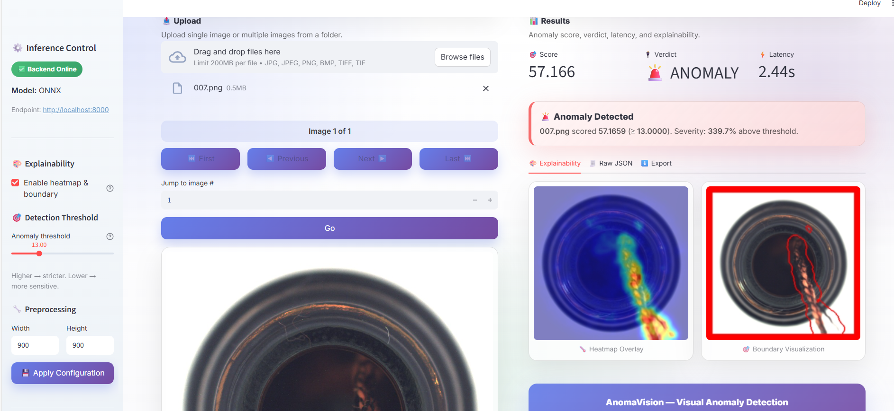
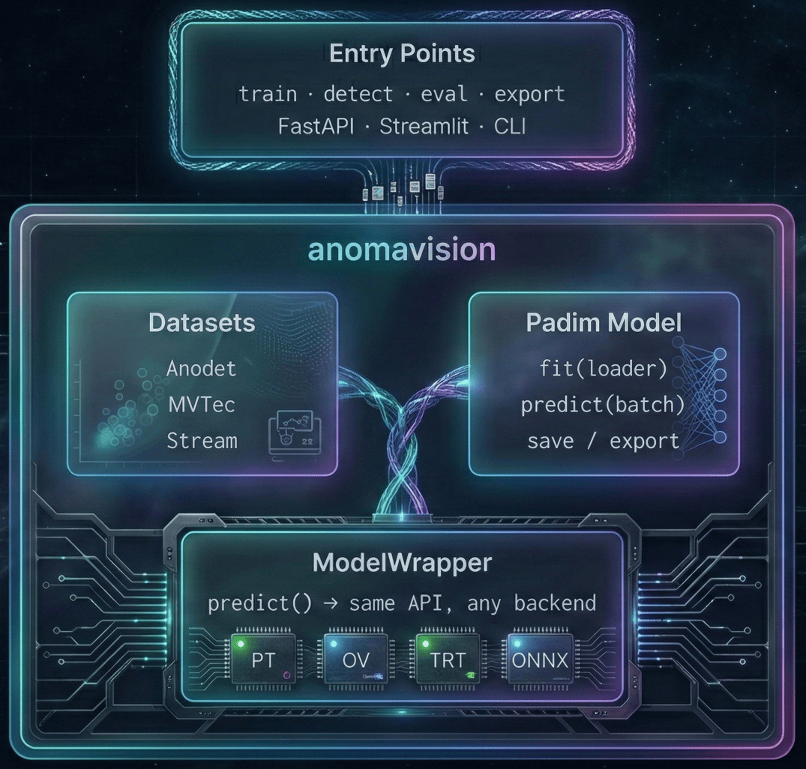

<div align="center">


# AnomaVision 🔍

**high-performance visual anomaly detection. Fast, lightweight, production-ready.**

AnomaVision detects defects without ever seeing defective examples during training.
<br>

[](https://pypi.org/project/anomavision/)
[](https://pypi.org/project/anomavision/)
[](https://www.python.org/)
[](https://pytorch.org/)
[](LICENSE)
[](https://onnx.ai/)
[](https://developer.nvidia.com/tensorrt)
[](https://docs.openvino.ai/)

<br>

[**Docs**](docs/quickstart.md) · [**Quickstart**](#-quickstart) · [**Models**](#-models--performance) · [**Tasks**](#-tasks--modes) · [**Integrations**](#-integrations) · [**Issues**](https://github.com/DeepKnowledge1/AnomaVision/issues) · [**Discussions**](https://github.com/DeepKnowledge1/AnomaVision/discussions)

</div>

---

## What is AnomaVision?

AnomaVision delivers **visual anomaly detection** optimized for production deployment. Based on PaDiM, it learns the distribution of normal images in a **single forward pass** — no labels, no segmentation masks, no lengthy training loops.

The result: a 15 MB model that runs at **43 FPS on CPU** and **547 FPS on GPU**, with higher AUROC than the existing best-in-class baseline.

```python
import anomavision

model = anomavision.Padim(backbone="resnet18", device="cuda")
model.fit(train_loader)                   # train on normal images only
scores, maps = model.predict(test_batch)  # anomaly score + heatmap per image
```

---

## 🚀 Quickstart

### Install

> ⚠️ **`torch` is hardware-specific.** A plain `pip install anomavision` skips PyTorch entirely. Always install with an `[extra]` to get the right binaries for your hardware.

**Don't have `uv`?** Install it first — it's faster than pip and handles PyTorch's hardware routing correctly:

```bash
pip install uv
```

---
#### Option A — From Source (development)

```bash
git clone https://github.com/DeepKnowledge1/AnomaVision.git
cd AnomaVision

# Create and activate a virtual environment
uv venv --python 3.11 .venv
source .venv/bin/activate        # Windows: .venv\Scripts\Activate.ps1

# Install with your hardware extra
uv sync --extra cpu              # CPU
uv sync --extra cu121            # CUDA 12.1
```

Or install from `requirements.txt` directly:

```bash
uv pip install -r requirements.txt
```

---

#### Option B — From PyPI (production / quick start)

```bash
# CPU  ·  Mac, CI runners, edge devices
uv pip install "anomavision[cpu]"

# NVIDIA GPU  ·  pick your CUDA version
uv pip install "anomavision[cu118]"   # CUDA 11.8
uv pip install "anomavision[cu121]"   # CUDA 12.1
uv pip install "anomavision[cu124]"   # CUDA 12.4
```

---


#### Option C — Already installed without extras?

If you're seeing `ModuleNotFoundError: No module named 'torch'`, add PyTorch into your current environment:

```bash
# CPU
uv pip install torch torchvision torchaudio

# GPU (CUDA 12.1)
uv pip install torch torchvision torchaudio --index-url https://download.pytorch.org/whl/cu121
```

---

#### Verify

```bash
python -c "import anomavision, torch; print('✅ Ready —', torch.__version__)"
```

### Python API

```python
import torch
import anomavision
from anomavision import padim
from torch.utils.data import DataLoader

# Dataset (normal images only)
dataset = anomavision.AnodetDataset(
    image_directory_path="./dataset/bottle/train/good",
    resize=(224, 224),
    crop_size=(224, 224),
    normalize=True,
)
loader = DataLoader(dataset, batch_size=16)

# Train
model = anomavision.Padim(backbone="resnet18", device="cpu", feat_dim=100)
model.fit(loader)

# Save
torch.save(model, "padim_model.pt")                  # full model
model.save_statistics("padim_model.pth", half=True)  # compact stats-only

# Infer
batch, *_ = next(iter(loader))
scores, maps = model.predict(batch)
```

### CLI

```bash
# Train
python train.py --config config.yml

# Detect (images or folder)
python detect.py --config config.yml --img_path ./test_images --thresh 13.0

# Evaluate on MVTec
python eval.py --config config.yml --enable_visualization

# Export to ONNX / TorchScript / OpenVINO / all
python export.py --config config.yml --format all --precision fp16
```

### REST API

```python
import requests

with open("image.jpg", "rb") as f:
    r = requests.post("http://localhost:8000/predict", files={"file": f})

print(r.json()["anomaly_score"])   # e.g. 14.3
print(r.json()["is_anomaly"])      # True / False
```

---

## 📊 Models & Performance

### MVTec AD — Average over 15 Classes

| Model | Image AUROC ↑ | Pixel AUROC ↑ | CPU FPS ↑ | GPU FPS ↑ | Size ↓ |
|---|---|---|---|---|---|
| **AnomaVision** (resnet18) | **0.850** | **0.956** | **43.4** | **547** | **15 MB** |
| Anomalib PaDiM (baseline) | 0.810 | 0.935 | 13.0 | 356 | 40 MB |
| Δ | **+4.9%** | **+2.2%** | **+233%** | **+54%** | **−25%** |

> CPU: Intel Core i9 (single process). GPU: NVIDIA A100. Batch size 1.
> Reproduce: `python eval.py --config config.yml`

### VisA — Average over 12 Classes

| Model | Image AUROC ↑ | Pixel AUROC ↑ | CPU FPS ↑ |
|---|---|---|---|
| **AnomaVision** | **0.812** | **0.962** | **44.8** |
| Anomalib PaDiM | 0.783 | 0.954 | 13.5 |

<details>
<summary>📋 Per-class MVTec breakdown</summary>

| Class | AV Image AUROC | AL Image AUROC | AV Pixel AUROC | AL Pixel AUROC | AV FPS |
|---|---|---|---|---|---|
| bottle | 0.997 | 0.996 | 0.984 | 0.987 | 42.2 |
| cable | 0.772 | 0.742 | 0.936 | 0.935 | 36.1 |
| capsule | 0.839 | 0.846 | 0.929 | 0.977 | 40.2 |
| carpet | 0.908 | 0.594 | 0.971 | 0.987 | 44.0 |
| grid | 0.881 | 0.832 | 0.964 | 0.965 | 41.3 |
| hazelnut | 0.984 | 0.949 | 0.978 | 0.974 | 29.0 |
| leather | 0.985 | 0.879 | 0.985 | 0.982 | 48.7 |
| metal_nut | 0.940 | 0.878 | 0.963 | 0.963 | 41.4 |
| pill | 0.793 | 0.773 | 0.957 | 0.964 | 45.4 |
| screw | 0.941 | 0.787 | 0.970 | 0.982 | 42.4 |
| tile | 0.851 | 0.876 | 0.969 | 0.971 | 46.0 |
| toothbrush | 0.978 | 0.883 | 0.993 | 0.989 | 44.8 |
| transistor | 0.800 | 0.853 | 0.968 | 0.962 | 42.2 |
| wood | 0.986 | 0.915 | 0.973 | 0.975 | 45.3 |
| zipper | 0.914 | 0.979 | 0.972 | 0.971 | 41.0 |

</details>

---

## 🎯 Tasks & Modes

| Task | Train | Detect | Eval | Export | Stream | REST |
|---|:---:|:---:|:---:|:---:|:---:|:---:|
| Anomaly Detection (image score) | ✅ | ✅ | ✅ | ✅ | ✅ | ✅ |
| Anomaly Localization (pixel map) | ✅ | ✅ | ✅ | ✅ | ✅ | ✅ |
| Normal / Anomalous Classification | ✅ | ✅ | ✅ | ✅ | ✅ | ✅ |

### Export Formats

| Format | Flag | CPU | GPU | Edge | Quantization |
|---|---|:---:|:---:|:---:|:---:|
| PyTorch `.pt` | `pt` | ✅ | ✅ | — | — |
| ONNX `.onnx` | `onnx` | ✅ | ✅ | ✅ | INT8 dynamic / static |
| TorchScript `.torchscript` | `torchscript` | ✅ | ✅ | ✅ | — |
| OpenVINO (dir) | `openvino` | ✅ | — | ✅ | FP16 |
| TensorRT `.engine` | `engine` | — | ✅ | — | FP16 |
| C++ ONNX Runtime | — | ✅ | ✅ | ✅ | — |

```bash
python export.py \
  --model_data_path ./distributions/anomav_exp \
  --model padim_model.pt \
  --format onnx \
  --precision fp16 \
  --quantize-dynamic
```

---

## 📺 Streaming Sources

Run inference on **live sources** without changing your model or code — just update the config:

| Source | `stream_source.type` | Use case |
|---|---|---|
| Webcam | `webcam` | Lab / demo |
| Video file | `video` | Offline replay |
| MQTT | `mqtt` | Industrial IoT cameras |
| TCP socket | `tcp` | High-throughput line scanners |

```yaml
# stream_config.yml
stream_mode: true
stream_source:
  type: webcam
  camera_id: 0
model: padim_model.onnx
thresh: 13.0
enable_visualization: true
```

```bash
python detect.py --config stream_config.yml
```

---

## ⚙️ Configuration

All scripts accept `--config config.yml` and CLI overrides. **CLI always wins.**

```yaml
# Minimal working config.yml
dataset_path:    ./dataset
class_name:      bottle

resize:          [256, 192]
crop_size:       [224, 224]
normalize:       true
norm_mean:       [0.485, 0.456, 0.406]
norm_std:        [0.229, 0.224, 0.225]

backbone:        resnet18
batch_size:      16
feat_dim:        100
layer_indices:   [0, 1, 2]
output_model:    padim_model.pt
run_name:        exp1
model_data_path: ./distributions/anomav_exp

model:           padim_model.onnx
device:          auto        # auto | cpu | cuda
thresh:          13.0

log_level:       INFO
```

Full key reference: [`docs/config.md`](docs/config.md)

---

## 🔌 Integrations

| Integration | Description |
|---|---|
| **FastAPI** | REST API — `/predict`, `/predict/batch`, Swagger UI at `/docs` |
| **Streamlit** | Browser demo — heatmap overlay, threshold slider, batch upload |
| **C++ Runtime** | ONNX + OpenCV, no Python required — see [`docs/cpp/`](docs/cpp/README.md) |
| **OpenVINO** | Intel CPU/VPU edge optimization |
| **TensorRT** | NVIDIA GPU maximum throughput |
| **INT8 Quantization** | Dynamic + static INT8 via ONNX Runtime |

**Start the demo stack:**

```bash
# Terminal 1 — backend
uvicorn apps.api.fastapi_app:app --host 0.0.0.0 --port 8000

# Terminal 2 — UI
streamlit run apps/ui/streamlit_app.py -- --port 8000
```

Open **http://localhost:8501**

<div align="center">
  
</div>

---

## 📂 Dataset Format

AnomaVision uses [MVTec AD](https://www.mvtec.com/company/research/datasets/mvtec-ad) layout. Custom datasets work with the same structure:

```
dataset/
└── <class_name>/
    ├── train/
    │   └── good/          ← normal images only (no anomalies needed)
    └── test/
        ├── good/          ← normal test images
        └── <defect_name>/ ← anomalous test images (any subfolder name)
```

---

## 🏗️ Architecture




**Key design decisions:**

**PaDiM needs no gradient training.** Features are extracted once with a frozen ResNet. The model fits a multivariate Gaussian at each spatial location — training is a matrix decomposition, not backprop. That's why it finishes in ~8 seconds.

**`ModelWrapper` makes the backend transparent.** The same `predict(batch) → (scores, maps)` call works whether you loaded `.pt`, `.onnx`, `.engine`, or an OpenVINO directory. Every downstream caller — CLI, FastAPI, Streamlit, eval loop — uses the same interface.

**Adaptive Gaussian post-processing** is applied to score maps after inference. The kernel is sized relative to the image resolution, which is a key factor behind the Pixel AUROC gain over baseline.

---

## 🛠️ Development

```bash
# Clone and create environment
git clone https://github.com/DeepKnowledge1/AnomaVision.git
cd AnomaVision

uv venv --python 3.11 .venv
source .venv/bin/activate        # Windows: .venv\Scripts\Activate.ps1

# Install with dev dependencies
uv sync --extra cpu              # or --extra cu121 for GPU
uv pip install -r requirements.txt

# Test
pytest tests/

# Format + lint
black . && isort . && flake8 .
```

**Commit convention:**

```
feat(export):  add TensorRT INT8 calibration
fix(detect):   handle empty directories
docs(api):     improve ModelWrapper examples
```

Types: `feat` · `fix` · `docs` · `refactor` · `test` · `chore`

PRs must pass `pytest` + `flake8` and include doc updates if behavior changes. See [`docs/contributing.md`](docs/contributing.md).

---

## 🚢 Deploy

<details>
<summary><strong>Docker</strong></summary>

```dockerfile
# Use a specific digest or version for reproducibility
FROM python:3.11-slim

# Install uv directly from the official binary to keep the image lean
COPY --from=ghcr.io/astral-sh/uv:latest /uv /uvx /bin/

# Set production environment variables
ENV PYTHONDONTWRITEBYTECODE=1 \
    PYTHONUNBUFFERED=1 \
    UV_COMPILE_BYTECODE=1 \
    UV_LINK_MODE=copy

WORKDIR /app

# Install dependencies first (layer caching)
# We use --no-install-project because we only want the libs here
RUN --mount=type=cache,target=/root/.cache/uv \
    --mount=type=bind,source=uv.lock,target=uv.lock \
    --mount=type=bind,source=pyproject.toml,target=pyproject.toml \
    uv sync --frozen --no-install-project --extra cpu

# Copy the rest of the application
COPY . .

# Install the project itself
RUN --mount=type=cache,target=/root/.cache/uv \
    uv sync --frozen --extra cpu

    # GPU build? Replace --extra cpu with --extra cu121 (or your CUDA version)
    # in both uv sync steps.


# Place uv-installed binaries on the PATH
ENV PATH="/app/.venv/bin:$PATH"

EXPOSE 8000

# Use the venv's uvicorn directly
CMD ["uvicorn", "apps.api.fastapi_app:app", "--host", "0.0.0.0", "--port", "8000", "--workers", "4"]
```

```bash
docker build -t anomavision .
docker run -p 8000:8000 -v $(pwd)/distributions:/app/distributions anomavision
```

</details>

<details>
<summary><strong>Production (Gunicorn + Uvicorn)</strong></summary>

```bash
gunicorn apps.api.fastapi_app:app \
  --workers 4 \
  --worker-class uvicorn.workers.UvicornWorker \
  --bind 0.0.0.0:8000 \
  --timeout 120
```

</details>

> **Production tip:** Serve ONNX or TensorRT models — `.pt` inference is 2–3× slower than ONNX Runtime at batch size 1.

---

## ❓ FAQ

<details>
<summary><strong>Training is slow on CPU</strong></summary>

Lower `resize` (e.g. `[128, 128]`), reduce `batch_size`, or use `--device cuda`. PaDiM training is a single forward pass — it should finish in under 30 s for most datasets even on CPU.

</details>

<details>
<summary><strong>All anomaly scores are low / nothing detected</strong></summary>

Run `eval.py` first to see the score distribution histogram. Set `--thresh` just above the peak of the normal score distribution. Typical values: 10–20 for ResNet18 with default preprocessing.

</details>

<details>
<summary><strong>RuntimeError: Input size mismatch during inference</strong></summary>

Your `resize` / `crop_size` must match what was used at training time. Load the config saved alongside the model: `--config ./distributions/anomav_exp/exp1/config.yml`.

</details>

<details>
<summary><strong>CUDA version mismatch</strong></summary>

```bash
pip install torch torchvision --index-url https://download.pytorch.org/whl/cu121
```

Replace `cu121` with your actual CUDA version (`cu118`, `cu124`, etc.).

</details>

<details>
<summary><strong>Unsupported operator during ONNX export</strong></summary>

Try `--opset 16`. If it still fails, use `--format torchscript` — TorchScript has no ONNX operator constraints.

</details>

<details>
<summary><strong>Can I use my own dataset without MVTec structure?</strong></summary>

Yes. Put your normal training images in `<any_root>/train/good/`. For evaluation, add test images under `<root>/test/<defect_name>/`. No anomalous images are needed at training time.

</details>

More: [`docs/troubleshooting.md`](docs/troubleshooting.md)

---

## 🗺️ Roadmap

- [ ] Pre-trained model zoo for all 15 MVTec classes
- [ ] Multi-class single-checkpoint model
- [ ] Few-shot adaptation (5–10 anomalous examples)
- [ ] Native TensorRT export in `export.py`
- [ ] Pixel-level mask in REST `/predict` response
- [ ] ONNX Runtime Web (browser inference via WASM)
- [ ] Helm chart for Kubernetes deployment

[Request a feature →](https://github.com/DeepKnowledge1/AnomaVision/discussions)

---

## 📚 Documentation

| | |
|---|---|
| [Quick Start](docs/quickstart.md) | Train → detect → eval → export in 5 minutes |
| [CLI Reference](docs/cli.md) | All arguments for all scripts |
| [Python API](docs/api.md) | Library usage and class reference |
| [Config Guide](docs/config.md) | Every YAML key explained |
| [Benchmarks](docs/benchmark.md) | Full per-class results vs Anomalib |
| [FastAPI Backend](docs/fastapi_backend.md) | REST API setup and endpoints |
| [C++ Inference](docs/cpp/README.md) | Deploy without Python |
| [Troubleshooting](docs/troubleshooting.md) | Common issues and fixes |
| [Contributing](docs/contributing.md) | Development workflow |

---

## 💬 Community

- 🐛 [Issues](https://github.com/DeepKnowledge1/AnomaVision/issues) — bug reports
- 💡 [Discussions](https://github.com/DeepKnowledge1/AnomaVision/discussions) — questions, ideas, show & tell
- 📧 [deepp.knowledge@gmail.com](mailto:deepp.knowledge@gmail.com) — direct contact

---

## Citation

```bibtex
@software{anomavision2025,
  title   = {AnomaVision: Edge-Ready Visual Anomaly Detection},
  author  = {DeepKnowledge Contributors},
  year    = {2025},
  url     = {https://github.com/DeepKnowledge1/AnomaVision},
}
```

---

## License

Released under the [MIT License](LICENSE).
Built on [Anodet](https://github.com/OpenAOI/anodet) — thanks to the original authors.
