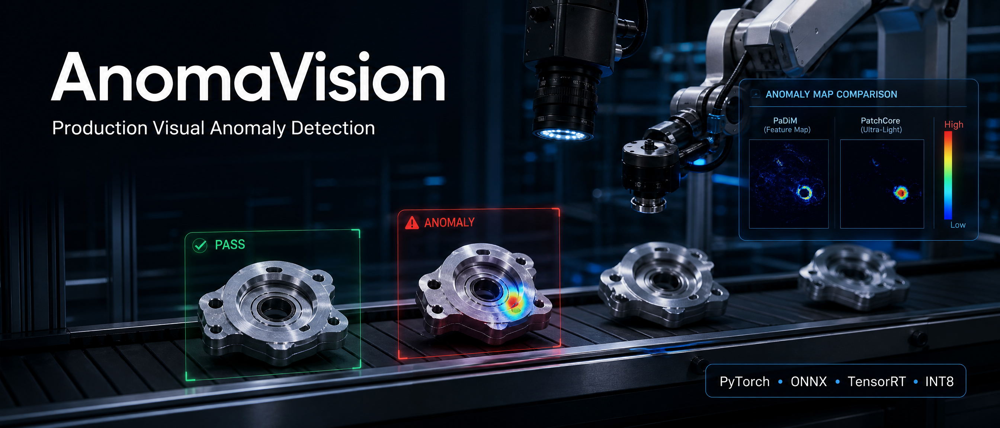

# AnomaVision

<p align="center">
  
</p>

<p align="center">
  <strong>Simple visual anomaly detection from normal images.</strong>
</p>

<p align="center">
  <a href="https://pypi.org/project/anomavision/"></a>
  <a href="https://pypi.org/project/anomavision/"></a>
  <a href="https://www.python.org/"></a>
  <a href="https://pytorch.org/"></a>
  <a href="https://onnx.ai/"></a>
  <a href="https://developer.nvidia.com/tensorrt"></a>
  <a href="https://docs.openvino.ai/"></a>
  <a href="https://github.com/DeepKnowledge1/AnomaVision/actions/workflows/ci.yml"></a>
  <a href="LICENSE"></a>
  <a href="docs/kv260_xmodel.md"></a>
</p>

AnomaVision is a computer vision project for finding **defects and unusual patterns** in images.

It supports three anomaly detection methods:

- **PaDiM** — a simple and fast baseline.
- **PatchCore** — a lightweight memory-based method.
- **EfficientAD** — a student/teacher model with a compact reconstruction branch for fast anomaly detection.

You only need **normal (`good`) images** to train the anomaly detector.

<p align="center">
  <a href="https://huggingface.co/spaces/DeepKnowledge1/mvtec-anomaly-detection"></a>
</p>

**New here?** Start with the [five-minute quickstart](docs/quickstart.md).

## What can AnomaVision do?

- Train anomaly detection models using normal images.
- Detect image-level anomalies.
- Create anomaly heatmaps showing where the problem is.
- Export models to **ONNX, OpenVINO, and TensorRT**.
- Export and compile **PaDiM and PatchCore to XModel for the AMD/Xilinx Kria KV260**.
- Switch between PaDiM, PatchCore, and EfficientAD without changing the CLI workflow.

## Quick start

### 1. Install

#### Option A — From Source (development)

```bash
git clone https://github.com/DeepKnowledge1/AnomaVision.git
cd AnomaVision
uv venv --python 3.11 .venv
source .venv/bin/activate        # Windows: .venv\\Scripts\\Activate.ps1
uv sync --extra cpu              # CPU
uv sync --extra cu121            # CUDA 12.1
```

#### Option B — From PyPI (production / quick start)

```bash
uv pip install "anomavision[cpu]"
uv pip install "anomavision[cu121]"
```

For other environments, see [Installation](docs/installation.md).

### 2. Prepare your images

Use a simple MVTec-style folder structure:

```text
dataset/
└── bottle/
    ├── ground_truth/
    ├── test/
    │   ├── broken_large/
    │   ├── broken_small/
    │   ├── contamination/
    │   └── good/
    └── train/
        └── good/
```

Training uses the **good** images. Test images can contain defects.

### 3. Choose an algorithm

The existing configuration format works unchanged:

```yaml
algorithm: padim
```

Switch to EfficientAD by changing one value:

```yaml
algorithm: efficientad
```

You can also use the native model selector:

```yaml
model:
  name: efficientad
```

The CLI commands remain the same.

### 4. Train

```bash
anomavision train --config config.yml
```

For a quick EfficientAD configuration, see [`examples/efficientad_cpu.yml`](examples/efficientad_cpu.yml).

### 5. Detect

```bash
anomavision detect --config config.yml --model model.pt --img_path ./test_images
```

### 6. Export

```bash
anomavision export --config config.yml --model model.pt --format onnx
```

### 7. Evaluate

```bash
anomavision eval --config config.yml --model model.pt --class_name bottle
```

For EfficientAD-specific options and limitations, see [EfficientAD](docs/efficientad.md).

## KV260 support

AnomaVision also supports a **Vitis AI workflow for PaDiM and PatchCore on the AMD/Xilinx Kria KV260**.

The workflow is:

```text
PyTorch → INT8 quantization → XModel → KV260 DPU compilation
```

Both PaDiM and PatchCore currently compile with **1 DPU subgraph** in the KV260 compiler.

The complete setup and commands are in the [KV260 XModel Guide](docs/kv260_xmodel.md).

> XModel compilation has been validated in the Vitis AI environment. Final on-device KV260 validation requires the physical hardware.

## Production Autopilot

**Production Autopilot is the easiest way to move from two trained models to one deployable choice.** It compares PaDiM and ultra-light PatchCore on the same labeled test split, calibrates a separate threshold for each, profiles median and P95 latency on your hardware, checks localization health, and packages the selected artifact with a self-contained HTML dashboard.

Train both candidate models first, then run the complete labeled split on CPU:

```bash
anomavision autopilot `
  --config config.yml `
  --padim_model ./distributions/padim/bottle/anomav_exp/model.pt `
  --patchcore_model ./distributions/patchcore/bottle/anomav_exp/model.pt `
  --efficientad_model ./distributions/efficientad/bottle/anomav_exp/model.onnx `
  --device cpu `
  --validation_split 1.0 `
  --target_latency_ms 50 `
  --output_dir ./production_package
```

Open `production_package/production_autopilot_report.html` to see the selected model, AUROC, calibrated threshold, localization diagnostics, memory, median latency, P95 latency, and deployment recommendation. See [`docs/production_deployment.md`](docs/production_deployment.md) for details.

## Documentation

| Topic | Guide |
|---|---|
| Quick start | [`docs/quickstart.md`](docs/quickstart.md) |
| Installation | [`docs/installation.md`](docs/installation.md) |
| CLI and configuration | [`docs/cli.md`](docs/cli.md), [`docs/config.md`](docs/config.md) |
| EfficientAD | [`docs/efficientad.md`](docs/efficientad.md) |
| Python API | [`docs/api.md`](docs/api.md) |
| KV260 / XModel | [`docs/kv260_xmodel.md`](docs/kv260_xmodel.md) |
| Production deployment | [`docs/production_deployment.md`](docs/production_deployment.md) |
| Benchmarks | [`docs/benchmark.md`](docs/benchmark.md) |
| Troubleshooting | [`docs/troubleshooting.md`](docs/troubleshooting.md) |
| Examples | [`examples/README.md`](examples/README.md) |
| Contributing | [`docs/contributing.md`](docs/contributing.md) |

## Python example

```python
import torch
import anomavision
from torch.utils.data import DataLoader

train_set = anomavision.AnodetDataset("./dataset/bottle/train/good")
train_loader = DataLoader(train_set, batch_size=1, shuffle=False)

model = anomavision.EfficientAD(device=torch.device("cpu"))
model.fit(train_loader, epochs=1)

batch = next(iter(train_loader))[0]
scores, maps = model.predict(batch)
```

## License

AnomaVision is released under the **MIT License**. See [`LICENSE`](LICENSE).

## Questions and contributions

Found a problem or have an idea? Feel free to open an issue or contribute to the project.
