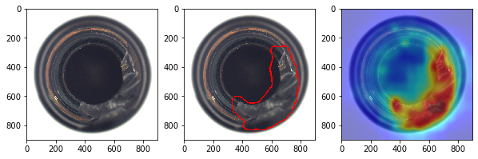
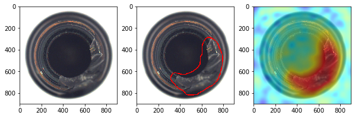

# AnomaVision

<p align="center">
  
</p>

<p align="center">
  <strong>Production-oriented visual anomaly detection from normal images.</strong>
</p>

<p align="center">
  <a href="https://pypi.org/project/anomavision/"></a>
  <a href="https://pypi.org/project/anomavision/"></a>
  <a href="https://www.python.org/"></a>
  <a href="https://pytorch.org/"></a>
  <a href="https://onnx.ai/"></a>
  <a href="https://developer.nvidia.com/tensorrt"></a>
  <a href="https://docs.openvino.ai/"></a>
  <a href="LICENSE"></a>
</p>

AnomaVision supports **PaDiM** and lightweight **PatchCore**, image-level scores, pixel-level maps, and deployment exports.

<p align="center">
  <a href="https://huggingface.co/spaces/DeepKnowledge1/mvtec-anomaly-detection"></a>
</p>

## Why use it?

- Train with normal images only; anomaly labels are not required for training.
- Use **PaDiM** for the default fast baseline or **PatchCore** for a compact nearest-neighbor memory bank.
- Run inference through PyTorch, ONNX Runtime, OpenVINO, or native TensorRT.
- Export FP16 or calibrated INT8 TensorRT engines for NVIDIA production deployments.

Benchmark results and reproduction details are documented in [`docs/benchmark.md`](docs/benchmark.md). Treat benchmark numbers as workload-specific, and reproduce them on your own hardware before making production claims.

## Quickstart

### 1. Install

```bash
pip install uv
uv pip install "anomavision[cpu]"
```

For NVIDIA GPUs, choose the matching extra such as `anomavision[cu121]`. Source installation and environment setup are described in [`docs/installation.md`](docs/installation.md).

### 2. Prepare data

Use an MVTec-style directory. Training uses only the `good` images:

```text
dataset/
└── bottle/
    ├── train/good/
    └── test/
        ├── good/
        └── scratch/
```

### 3. Train

Before running the command, open `config.yml` and set `dataset_path` to the folder that contains your class folder, for example `./dataset`. Keep `class_name: bottle` if your data is stored under `./dataset/bottle/`.

```bash
anomavision train --config config.yml
```

The default configuration trains PaDiM. To use the ultra-light PatchCore path, change these values in `config.yml`:

```yaml
algorithm: patchcore
layer_indices: [0]
coreset_ratio: 0.02
max_memory_patches: 2048
patch_grid: 14
```

The model and compact deployment artifact are saved under `model_data_path`.

### 4. Detect and evaluate

```bash
anomavision detect --config config.yml --img_path ./dataset/bottle/test
anomavision eval --config config.yml
```

### 5. Export

```bash
# Portable ONNX export
anomavision export --config config.yml --format onnx

# Native TensorRT FP16 export
anomavision export --config config.yml --format tensorrt \
  --device cuda --tensorrt-precision fp16

# Native TensorRT calibrated INT8 export
anomavision export --config config.yml --format tensorrt \
  --device cuda --tensorrt-precision int8 \
  --calib-dir ./dataset/bottle/train/good --calib-samples 100
```

Every command provides help:

```bash
anomavision --help
anomavision train --help
anomavision export --help
```

## Production Autopilot

Production Autopilot compares PaDiM and ultra-light PatchCore, calibrates an operating threshold, measures latency on your selected device, and creates a self-contained deployment package with an **HTML report**. Train or export both candidate models first, then run:

```bash
anomavision autopilot \
  --config config.yml \
  --padim_model ./distributions/padim/bottle/anomav_exp/model.pt \
  --patchcore_model ./distributions/patchcore/bottle/anomav_exp/model.pt \
  --device cpu \
  --target_latency_ms 50 \
  --output_dir ./production_package
```

The report explains the selected model, validation metrics, threshold, memory, and measured latency. See [`docs/production_deployment.md`](docs/production_deployment.md) for GPU, TensorRT, INT8, and packaging details.

## Visual overview

The same pipeline supports compact edge inference and spatial anomaly localization. In each result strip, the panels show the **input image**, the **detected boundary**, and the **anomaly heatmap** from left to right.

### PaDiM: distribution-based heatmap

PaDiM models the feature distribution of normal images. Its heatmap is typically smoother and emphasizes regions that differ from that learned distribution.



### Ultra-light PatchCore: nearest-patch heatmap

PatchCore compares image patches with a compact normal-feature memory bank. Its heatmap can show more local texture and sharper nearest-patch differences while using bounded memory for production inference.



## Choosing a model

| Model | Best starting point | Memory use | Production note |
|---|---|---:|---|
| PaDiM | Fast, simple baseline | Low | Recommended first experiment |
| Lightweight PatchCore | Lower-memory nearest-patch baseline | Very low by default | Use `coreset_ratio`, `max_memory_patches`, and `patch_grid` to control latency |

## Documentation

| Topic | Guide |
|---|---|
| Installation | [`docs/installation.md`](docs/installation.md) |
| Five-minute workflow | [`docs/quickstart.md`](docs/quickstart.md) |
| CLI and configuration | [`docs/cli.md`](docs/cli.md), [`docs/config.md`](docs/config.md) |
| Python API | [`docs/api.md`](docs/api.md) |
| PatchCore and TensorRT deployment | [`docs/production_deployment.md`](docs/production_deployment.md) |
| Benchmark methodology | [`docs/benchmark.md`](docs/benchmark.md) |
| Troubleshooting | [`docs/troubleshooting.md`](docs/troubleshooting.md) |
| Contributing | [`docs/contributing.md`](docs/contributing.md) |

## Python API

```python
import torch
from torch.utils.data import DataLoader
import anomavision

train_set = anomavision.AnodetDataset("./dataset/bottle/train/good")
train_loader = DataLoader(train_set, batch_size=16, shuffle=False)

model = anomavision.Padim(backbone="resnet18", device=torch.device("cpu"))
model.fit(train_loader)
batch = next(iter(train_loader))
if isinstance(batch, (tuple, list)):
    batch = batch[0]
scores, maps = model.predict(batch)
```

## Community and adoption

The most useful path to adoption is a small, reproducible example rather than more README text: publish one benchmark script, one production export example, a model card with hardware and preprocessing details, and a short comparison against Anomalib. Invite users to reproduce the result, report failures, and contribute adapters for their own datasets. See [`docs/production_deployment.md`](docs/production_deployment.md) for the project’s recommended release checklist.

## License

AnomaVision is released under the MIT License. See [`LICENSE`](LICENSE).
