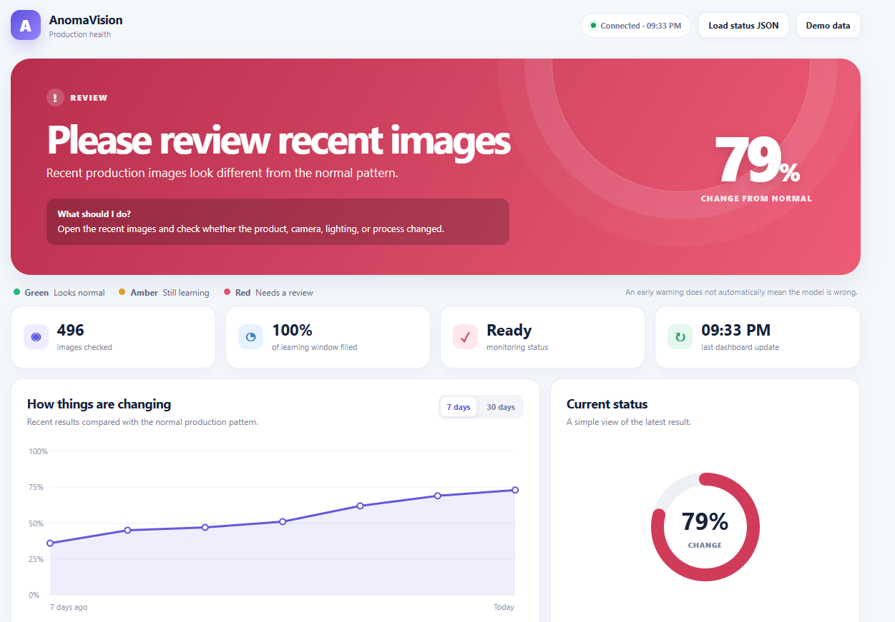

# Anomaly Detection: Production Data Drift

<p align="center">
  
</p>

## Overview

AnomaVision monitors whether production images change relative to a trusted normal reference population.

Drift monitoring is an **observer** around the existing anomaly detector. It does not change anomaly scores or localization.

```text
Trusted normal images
        ↓
Reference embeddings (.npy)
        ↓
Normal production inference
        ↓
Drift monitor
        ↓
drift_status.json + dashboard
```

> **Important:** drift is an early-warning signal. It does not prove that an image is defective or that model accuracy has degraded.

## Quick workflow

1. Generate a reference from trusted normal images.
2. Run detection with the same model/algorithm and the reference file.
3. Open the dashboard and investigate detected changes.

## 1. Generate the reference

The reference must come from **normal/good images** that represent an approved operating condition.

### Windows PowerShell — PatchCore + PyTorch

```powershell
python -m anomavision.drift_reference `
  --config config.yml `
  --img_path "D:\\01-DATA\\VisA_pytorch\\candle\\train\\good" `
  --model "model.pt" `
  --model_data_path ".\\distributions" `
  --algorithm patchcore `
  --class_name candle `
  --run_name anomav_exp `
  --device cpu `
  --batch_size 8 `
  --max_samples 500 `
  --output ".\\drift\\reference_embeddings_patchcore_onnx.npy"
```

Verify the reference:
```powershell
python -c "import numpy as np; x=np.load('./drift/reference_embeddings_patchcore_onnx.npy'); print(x.shape)"
```

Example:
```text
(500, 15)
```

The exact feature dimension depends on the selected model and representation.

### Reference with ONNX

If the production model is ONNX, generate the reference from the **same ONNX model**:
```powershell
python -m anomavision.drift_reference `
  --config config.yml `
  --img_path "D:\\01-DATA\\VisA_pytorch\\candle\\train\\good" `
  --model "model.onnx" `
  --model_data_path ".\\distributions" `
  --algorithm patchcore `
  --class_name bottle `
  --run_name anomav_exp `
  --device cpu `
  --batch_size 1 `
  --max_samples 500 `
  --output ".\\drift\\reference_embeddings_patchcore_onnx.npy"
```

## 2. Run detection with drift monitoring

Use the **same algorithm and compatible model representation** used to create the reference.

### PatchCore + ONNX
```powershell
python -m anomavision.cli detect `
  --config config.yml `
  --model "model.onnx" `
  --enable-drift-monitoring `
  --algorithm patchcore `
  --batch_size 1 `
  --drift-reference ".\\drift\\reference_embeddings_patchcore_onnx.npy"
```

### PatchCore + PyTorch
```powershell
python -m anomavision.cli detect `
  --config config.yml `
  --model "model.pt" `
  --enable-drift-monitoring `
  --algorithm patchcore `
  --drift-reference ".\\drift\\reference_embeddings_patchcore_onnx.npy"
```

## 3. Open the dashboard

When detection starts, the live dashboard is available at:
```text
http://127.0.0.1:7860/anomavision_dashboard.html
```

The monitor also writes:
```text
./drift/drift_status.json
```

The dashboard provides:
- monitoring status
- samples and rolling window
- drift level
- recent production images
- technical metrics

## Reference compatibility

The reference and production model must use compatible representations.

Keep separate reference files for different algorithms/models:
```text
drift/
├── reference_embeddings_padim.npy
└── reference_embeddings_patchcore_onnx.npy
```

Example mismatch:
```text
Reference:  (500, 64)
Production: (1, 15)
Result:     dimension mismatch → drift check skipped
```

Do not mix a PaDiM reference with PatchCore production inference, or references from different model configurations.

## What the monitor measures

The monitor compares the trusted reference with a bounded rolling window of production representations.

Available metrics include:
- **PSI** — distribution shift
- **Mean shift** — movement of feature means
- **Standard-deviation shift** — change in feature spread
- **Cosine shift** — change in embedding direction
- **Drift score** — normalized dashboard indicator

The explicit stable/drift state is controlled by the configured PSI threshold.

## Useful options
```text
--enable-drift-monitoring       Enable monitoring
--drift-reference <file>       Trusted .npy reference
--drift-window 500              Rolling production window
--drift-min-samples 100        Samples before evaluation
--drift-threshold 0.20         PSI threshold
--drift-evaluation-interval 25 Evaluation frequency
--drift-output <file>          JSON status output
```

Example:
```powershell
anomavision detect `
  --config config.yml `
  --model "model.onnx" `
  --enable-drift-monitoring `
  --algorithm patchcore `
  --batch_size 1 `
  --drift-reference ".\\drift\\reference_embeddings_patchcore_onnx.npy" `
  --drift-window 500 `
  --drift-min-samples 100 `
  --drift-threshold 0.20 `
  --drift-evaluation-interval 25 `
  --drift-output ".\\drift\\drift_status.json"
```

## Monitoring states

### Collecting data
The monitor is warming up and has not collected enough samples.

### Stable
The current production distribution is below the configured drift threshold.

### Drift detected
The current production distribution has reached or exceeded the configured threshold.

### Monitoring unavailable
No valid monitoring result is available. This should not be treated as stable.

## When drift is detected

1. Check the recent production images.
2. Check camera, lighting, focus, position, preprocessing, and product variant.
3. Compare with available quality/inspection measurements.
4. Decide whether the change is expected.
5. Update the reference deliberately if the new population is approved.

Do not automatically replace the model or reference only because drift was detected.

## Machine-readable status

Default output:
```text
./drift/drift_status.json
```

Example:
```json
{
  "samples_seen": 900,
  "window_size": 500,
  "window_fill": 500,
  "ready": true,
  "status": "drift",
  "drift_score": 0.7908556872,
  "psi": 16.6859248018,
  "mean_shift": 0.2237742298,
  "std_shift": 0.8994141984,
  "cosine_shift": 0.0240436164,
  "threshold": 0.2
}
```

The JSON can be consumed by dashboards, APIs, alerting systems, or other production services.

## Backend behavior

### PyTorch
For supported PyTorch models, the representation from normal inference can be reused by the drift monitor where available.

### ONNX
ONNX models can expose the model representation as an additional output. The existing anomaly score/map outputs remain unchanged.

### Hailo / KV260
Drift monitoring does not replace or modify the existing Hailo/KV260/XModel inference path. It is an observer around inference.

## Troubleshooting

### `embedding dimension does not match reference`

Check the reference shape:
```powershell
python -c "import numpy as np; x=np.load('./drift/reference_embeddings_patchcore_onnx.npy'); print(x.shape)"
```

Then make sure the production model generates the same feature dimension.

For example, if production reports `15 != 64`, the reference is from a different representation. Generate a new reference using the same algorithm/model used for production.

### Reference file is not found

```powershell
Test-Path ".\\drift\\reference_embeddings_patchcore_onnx.npy"
```

### Dashboard does not start

Check the detection log and make sure drift monitoring is enabled. The dashboard is separate from anomaly inference and should not become a dependency of the detector.

## Re-create a reference

Create a new reference when a new normal production population has been intentionally approved.

Keep reference files versioned instead of continuously replacing the baseline with the latest production data.

## Summary

```text
1. Trusted normal images
          ↓
2. Generate reference .npy
          ↓
3. Run detection + drift monitoring
          ↓
4. Review dashboard / drift_status.json
```

The key rule is simple: **the reference and production model must use the same compatible representation.**
