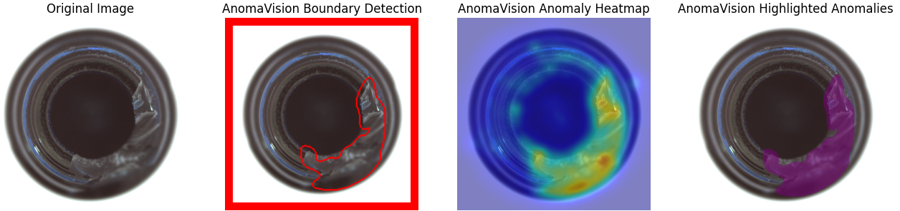
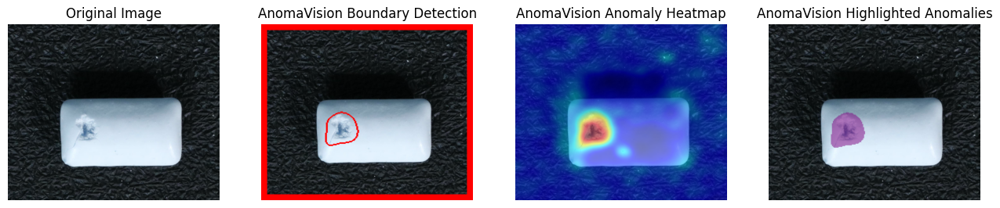

# 📊 Benchmarks

We compare **AnomaVision** against **Anomalib** using **(PaDiM baseline)** on **MVTec AD** and **Visa** datasets.

Metrics: **Image AUROC, Pixel AUROC, FPS, Model Size, and Memory Usage**.

---

## 1. MVTec AD — Average Results (15 classes)

| Metric (avg)      | AnomaVision (Ours)  | Anomalib (Baseline) |
| ----------------- | ---------- | ------------- |
| **Image AUROC ↑** | **0.8499** | 0.8102        |
| **Pixel AUROC ↑** | **0.9562** | 0.9354        |
| **FPS ↑**         | **43.41**  | 13.03         |
| **Size (MB) ↓**   | **30.5**   | 40.5          |
| **Memory (MB) ↓** | **1647**   | 1696          |

✅ AnomaVision is **+4% higher Image AUROC**, **+2% higher Pixel AUROC**, and **3× faster**.

---

### Per-Class Breakdown

| Class      | AnomaVision Image AUROC | Anomalib Image AUROC | AnomaVision Pixel AUROC | Anomalib Pixel AUROC | AnomaVision FPS | Anomalib FPS |
| ---------- | -------------- | -------------- | -------------- | -------------- | ------ | ------ |
| bottle     | 0.997          | 0.996          | 0.984          | 0.987          | 42.17  | 13.42  |
| cable      | 0.772          | 0.742          | 0.936          | 0.935          | 36.09  | 12.82  |
| capsule    | 0.839          | 0.846          | 0.929          | 0.977          | 40.21  | 8.86   |
| carpet     | 0.908          | 0.594          | 0.971          | 0.987          | 43.95  | 8.26   |
| grid       | 0.881          | 0.832          | 0.964          | 0.965          | 41.26  | 11.85  |
| hazelnut   | 0.984          | 0.949          | 0.978          | 0.974          | 28.99  | 13.01  |
| leather    | 0.985          | 0.879          | 0.985          | 0.982          | 48.69  | 14.05  |
| metal\_nut | 0.940          | 0.878          | 0.963          | 0.963          | 41.43  | 13.35  |
| pill       | 0.793          | 0.773          | 0.957          | 0.964          | 45.44  | 14.01  |
| screw      | 0.941          | 0.787          | 0.970          | 0.982          | 42.41  | 12.40  |
| tile       | 0.851          | 0.876          | 0.969          | 0.971          | 45.97  | 15.06  |
| toothbrush | 0.978          | 0.883          | 0.993          | 0.989          | 44.82  | 14.15  |
| transistor | 0.800          | 0.853          | 0.968          | 0.962          | 42.21  | 12.21  |
| wood       | 0.986          | 0.915          | 0.973          | 0.975          | 45.34  | 13.40  |
| zipper     | 0.914          | 0.979          | 0.972          | 0.971          | 41.04  | 12.81  |

---

## 2. Visa — Average Results (12 classes)

| Metric (avg)      | AnomaVision (Ours)  | Anomalib (Baseline) |
| ----------------- | ---------- | ------------- |
| **Image AUROC ↑** | **0.8123** | 0.7825        |
| **Pixel AUROC ↑** | **0.9618** | 0.9542        |
| **FPS ↑**         | **44.76**  | 13.52         |
| **Size (MB) ↓**   | **30.5**   | 40.5          |
| **Memory (MB) ↓** | **2638**   | 2796          |

✅ On Visa, AnomaVision is **+3% better on Image AUROC**, **+0.7% on Pixel AUROC**, and **3.3× faster**.

---

### Per-Class Breakdown

| Class       | AnomaVision Image AUROC | Anomalib Image AUROC | AnomaVision Pixel AUROC | Anomalib Pixel AUROC | AnomaVision FPS | Anomalib FPS |
| ----------- | -------------- | -------------- | -------------- | -------------- | ------ | ------ |
| candle      | 0.866          | 0.868          | 0.973          | 0.977          | 40.25  | 13.48  |
| capsules    | 0.654          | 0.595          | 0.916          | 0.920          | 43.29  | 14.52  |
| cashew      | 0.886          | 0.889          | 0.959          | 0.960          | 46.17  | 14.51  |
| chewinggum  | 0.970          | 0.971          | 0.993          | 0.990          | 45.42  | 13.36  |
| fryum       | 0.836          | 0.803          | 0.967          | 0.967          | 43.89  | 13.83  |
| macaroni1   | 0.803          | 0.767          | 0.948          | 0.949          | 43.81  | 13.46  |
| macaroni2   | 0.574          | 0.640          | 0.942          | 0.942          | 39.62  | 13.84  |
| pcb1        | 0.909          | 0.872          | 0.981          | 0.978          | 45.38  | 13.62  |
| pcb2        | 0.789          | 0.774          | 0.975          | 0.970          | 46.76  | 13.72  |
| pcb3        | 0.691          | 0.573          | 0.971          | 0.963          | 41.47  | 13.57  |
| pcb4        | 0.925          | 0.880          | 0.991          | 0.984          | 44.38  | 13.06  |
| pipe\_fryum | 0.834          | 0.782          | 0.982          | 0.970          | 44.38  | 13.63  |

---

## 3. Key Insights

* **3× faster inference** across both datasets
* **Smaller model size** (30 MB vs 40 MB)
* **Lower memory usage**
* **Consistent AUROC improvements** on most classes

---
##  4. Visual Results

 
<em>MVTec AD Dataset</em>
 
 

 
<em>Visa Dataset</em>
 

👉 Benchmarks confirm: **AnomaVision is edge-ready, lightweight, and faster — without sacrificing accuracy.**

---
